<!--!
[](--logo link-- 'Microsoft Industry-Based Challenges')
-->
# Industry-Based Challenges: Personalizations  

## Hands-on Lab 

### March 2021  

Information in this document, including URL and other Internet Web site references, is subject to change without notice. Unless otherwise noted, the example companies, organizations, products, domain names, e-mail addresses, logos, people, places, and events depicted herein are fictitious, and no association with any real company, organization, product, domain name, e-mail address, logo, person, place or event is intended or should be inferred. Complying with all applicable copyright laws is the responsibility of the user. Without limiting the rights under copyright, no part of this document may be reproduced, stored in or introduced into a retrieval system, or transmitted in any form or by any means (electronic, mechanical, photocopying, recording, or otherwise), or for any purpose, without the express written permission of Microsoft Corporation.

Microsoft may have patents, patent applications, trademarks, copyrights, or other intellectual property rights covering subject matter in this document. Except as expressly provided in any written license agreement from Microsoft, the furnishing of this document does not give you any license to these patents, trademarks, copyrights, or other intellectual property.

The names of manufacturers, products, or URLs are provided for informational purposes only and Microsoft makes no representations and warranties, either expressed, implied, or statutory, regarding these manufacturers or the use of the products with any Microsoft technologies. The inclusion of a manufacturer or product does not imply endorsement of Microsoft of the manufacturer or product. Links may be provided to third party sites. Such sites are not under the control of Microsoft and Microsoft is not responsible for the contents of any linked site or any link contained in a linked site, or any changes or updates to such sites. Microsoft is not responsible for webcasting or any other form of transmission received from any linked site. Microsoft is providing these links to you only as a convenience, and the inclusion of any link does not imply endorsement of Microsoft of the site or the products contained therein.

© 2020 Microsoft Corporation. All rights reserved.

Microsoft and the trademarks listed at <https://www.microsoft.com/legal/intellectualproperty/Trademarks/Usage/General.aspx> are trademarks of the Microsoft group of companies. All other trademarks are property of their respective owners.

# Personalizations challenge lab guide

## Abstract and learning objectives

Parts Unlimited, a subsidiary of Fabrikam Retail INC., has been feeling some pain and would like your help to redesign and implement some new solutions to be able to better compete in the current marketplace.  Among the main problems that Parts Unlimited is facing are 

*   Lack of connection between online and in-store data leading to an inability to provide a selection optimization that is tailored to a specific customer
*   Inconsistent pricing, promotion, product availability, and fulfillment strategies exist across their various channels
*   Customers are not completing orders due to redundant steps in the shopping journey, and encountering irrelevant interactions with the system
*   Currently, Parts Unlimited is unable to address latent customer needs
*   Parts Unlimited is unable to deliver an engaging and compelling experience to their customers regardless of platform or location.
*   Customer experiences vary when shopping across channels, including having fragmented and inconsistent experiences. 
*   Parts Unlimited currently is unable to maximize the effectiveness of their workforce.

To remedy this solution, Parts Unlimited is asking you to deliver a solution that will allow their customers to experience a smooth and relevant experience, regardless of the platform, device, and/or channel from which they are shopping. Of great importance is the ability to deliver dynamic and rich content that includes augmented and mixed-reality experiences.  Furthermore, customer data should be used to present relevant shopping experiences and product consistency to delight their customers. 

Parts Unlimited wants to ensure that they have maximized their ad spend for increased ROI and increased revenue.  Additionally, Parts Unlimited wants their customers to have an engaging experience that is similar on all digital channels and in their brick-and-mortar stores. 

An additional piece of information Parts Unlimited would like is the ability to be able to optimize the utilization and effectiveness of their workforce.  

In the end, your solution should provide a vision that allows the audience (the Chief Marketing Officer, Chief Digital Officer, the Chief Data Officer, and the Customer Experience Manager) to understand how using this solution will give the information that is needed to deliver the Omni-Channel optimized solution. 

## Customer case study

### Customer situation

Parts Unlimited Retail, Inc has been selling goods through various retail channels for the past 15 years.  As various platforms and technologies have evolved, Parts Unlimited has struggled to keep up, but has done the best they could to continue to provide solutions for their customers.  

Currently, they have just over 200 brick-and-mortar stores but are planning to close 50+ of these stores next year, taking the number of physical locations down to 150 stores due to declining revenue and various other factors.  Of the remaining 150 stores, 35 of them are currently streamlined for an attempted re-branding that happened a few years ago.  The re-branded stores were chosen based on population bases of less than 50,000 in an 200 square mile radius or within 50 miles of a major metropolitan area. These re-branded "Parts Unlimited Hometown" stores eliminated most of the non-essential retail, such as sporting and workout equipment, and focused in on essentials like appliances, automotive, and kept a limited selection of electronics, only offering about 15% of the options for items like UHD televisions, antennas, and blu-ray players.  Customers have expressed frustrations when an advertisement in the local newspaper for Parts Unlimited included a great deal on a large-screen television only to find they have to order online or drive to the larger store in a city that is sometimes located over 50 miles away.  While it is clear that customers are not pleased with this solution, it is not clear if this is an effective strategy to save the company when it comes to providing a simplified retail option. 

In addition to re-branding efforts, in the past few years attempts have been made to enhance the web app for responsive delivery and a couple of apps were also built to specifically target IOS and Android devices. Unfortunately, the data from these applications and the web solution is not connected, and when a user switches devices or goes from a device to the web, the experience is not uniform, leading to confusion and frustration.  Questions such as "why isn't the item I selected on my phone in my cart when I go to the website?" are far too common.    

Parts Unlimited needs an ability to collect and analyze all of this data in order to make the best uniform solution possible.   The solution needs to allow for a user to be able to walk into a brick-and-mortar store and get the items they are looking for, or to be able to switch from any device to the web or from the web to a device and get a streamlined experience.  Finally, the customer needs to leave the shopping experience as an advocate for the company, having been delivered an experience that they would recommend to others.   

#### Customer's current process

Parts Unlimited currently has over 200 brick-and-mortar stores, with 50+ stores closing and 35 stores running the re-branded profile.  Some stores have a pre-determined, limited selection and a limited inventory of the products they do offer. 

Parts Unlimited has an MVC website written in the .Net Framework and has been previously upgraded to version 4.7.2. The website is supposed to be responsive, as it utilized Bootstrap for responsive layout, but the site is currently not able to work on a few devices due to some styling problems.  

In addition to the website, Parts Unlimited has an Android application written in native Java that is three versions behind the current version of Android, but has been upgraded enough to continue to work on newer devices, even though it does not necessarily leverage all of the features of newer devices.  

Along with the website and android app, a third app written in Swift is available for use on the Apple IOS devices.  

All applications and sites do work, but the user experience, including sign-on, shopping cart, and other factors is unique to each platform.  For example, a user must sign in on the website and then sign in again on the device, and the shopping cart is not shared across devices, so items added to the cart on the web do not show up on the phone, or vice-versa.

As a struggling retailer, Parts Unlimited has a limited amount of resources to apply to getting the entire experience upgraded, so they need you to come up with the best, cost-effective solution.   

### Current Process
 
 

### Customer needs

1. Deliver a seamless experience to the user, regardless of platform, device, or location (online or at brick-and-mortar traditional stores)

2. Use customer data to deliver a relevant shopping experience.

3. Provide a customer experience on any delivery that provides dynamic and rich content. 

4. Present relevant and consistent product information to the customers, including using customer data to choose relevant products, remove any redundant or unnecessary interactions.  Make the customer feel unique and valued through the experience.

5. Ensure that pricing, promotions, product availability are all consistent and easy to manage so that the experience is the same on all channels. 

6. Respond to customer needs, including the ability to fulfill latent customer needs. 

### Infographic for common scenarios
 
 

_High-level architecture_

1. Challenges will require you to build the environment to meet the customer requirements outlined above.  It should include: 

*   Ingestion of data
*   What solutions for ETL or ELT
*   Organization and/or filtering of data
*   Presentation of data


## Exercise 1: Build the architecture for collecting and ingesting (extract) data

_Data ingest_

1. What are your recommended options for ingesting payment transaction events and customer shopping data as they occur in a scalable way that can be easily processed while maintaining event order with no data loss?

2. Of the ingest options you identified previously, which would you recommend for Parts Unlimited's scenario?

### Success criteria

-	Determine and build the architecture for collecting data into Azure:

    o	On-premises data: customer information, inventory, sales/POS

    o	Online data: customer information, inventory, sales/POS

    o	Workforce optimization data: number of staff each shift, customers per hour

    o	Cost efficiency data: what products are being viewed and purchased most, and by what demographic (location, visitor persona, etc.)

    o	Online traffic and sources to the website (social media, search engines, direct email marketing, mobile app, etc.)

-	Determine and build the architecture for where to ingest data into Azure

_Data ingest solution_

The current solution does get data into a number of databases, but the data is incomplete and not able to be easily used.  The first part of the process will be to get the data ingested - to bring it into a state where it is ready to be used by the rest of the process.  By ingesting the data using Azure Data Factory, you can get the data and transform it if necessary.  In the end, you'll have a complete picture of your data ready to go for the next parts of the process.

In order to begin to work with the data from the various web app databases, you will be required to create a baseline environment with Azure Data Factory for data movement and processing. You will create a Data Factory service, and then install the Data Management Gateway which is the agent that facilitates data movement from multiple databases to Microsoft Azure.

   >**Note**: Complete the Before the challenge setup prior to proceeding to the challenge tasks below. Provide this link to participants to access the setup instructions.
   
   <https://github.com/msusdev/Industry-Personalization/blob/main/Challenge%20Labs/BeforeTheChallenge/BeforeHOL.md>
   

## Create an Azure Data Lake Storage account and Azure Synapse Analytics service

Before you can connect datasources, you will need to create an Azure Data Lake storage account and the Azure Synapse Analytics service.

### Task 1: Create an Azure Data Lake Storage account

1. Open a web browser and navigate to the Azure portal.

   ```bash  
    https://portal.azure.com
   ``` 

2.  Navigate to the Resource group again and Select **+Add** to create a new resource
   
3.  Search and Select **Storage account** to create a storage account

4.  Complete the following information:
       - Subscription: Your Azure subscription
       - Resource group: use existing
       - Region: same as application created in Before HOL (Central US)
       - Name: Create a unique name
       - Performance: Standard
       - Account kind: StorageV2 (general purpose v2)
       - Replication: Locally-redundant storage (LRS)
  
       'Fields to complete to create the storage account')


5.  Select **Next** three times to get to the **Advanced** tab
6.  On the **Advanced** tab, locate **Data Lake Storage Gen2**, and select **Enabled** for Hierarchical namespace
   
      

6.  Select **Review + create**
7.  Select **Create** to create the storage account

### Task 2: Create an Azure Synapse Analytics service

1.  Search **Azure Synapse Analytics** and select **Create Synapse workspace**

      

2. On the **Create Synapse workspace** blade, complete the following information.
- Subscription: select existing subscription
- Resource group: Same as created in **Before the Challenge**
- Managed resource group: Leave blank and it will be created
- Workspace name: Enter a unique name
- Region: Select the same region from **Before the Challenge**
- Data Lake Storage account: Select the account created in step 3
- File system name: Select **Create new** and enter a name

   


3.  Select **Next: Security**
    
4.  Replace the **Admin username** with the username **msibcchallenger**. This is the same username provided for the Azure SQL Databases created in the **Before the Challenge** configuration
5.  Use the same password used in the **Before the Challenge** for the SQL Databases
6.  Select **Review + create**
    
          

7.  When validation succeeds, Select **Create**
8.  When deployment is complete, select **Go to resource**
9.  Under **Analytics pools**, select **SQL pools**

          

10. Select **+New**
    
      
          
11. Enter a name for the **Dedicated SQL pool name** and change the **Performance level** to **DW100c**
12. Select **Review + create**

      
      

### Task 3: Create Azure Data Factory

1. Navigate to the Resource group created in the Before HOL setup instructions.
   
2. Select **+Add** to create a new resource

   


3. Search for **Data Factory** and select **Create**

   

4. Complete the following information:
   - Subscription: Your Azure subscription
   - Resource group: use existing
   - Region: same as application created in Before HOL (Central US)
   - Name: Create a unique name

   


5. On the Git configuration tab, select the box for **Configure Git later**

6. Select **Review + create** and then **Create** to create the Data Factory

7. Select **Go to resource** when the Data Factory deployment is complete

   

   >**Note**: In order to meet Parts Plus' requirements for presenting data, we will need to analyze the data from the various store websites.  Data Factory will be used to move this data from the SQL databases to an Azure Storage Account that can then be accessed by Azure Databricks or Azure Synapse Analytics.

8.  Navigate back to the Resource group and select the **Data factory** service that you created.
   
9.  Select **Author & Monitor** on the overview blade

      


## Exercise 2: Build the architecture for loading and transforming data

_Data transformation_

1. What solutions offer options for ETL and/or ELT?  

2. Which option would you recommend and why?

_Data processing_

1. How will you filter the data to get relevant information?

2. How will you ensure that data processes are repeatable?

### Success criteria

-	Determine and build the architecture for loading the data

    o	Understand what data is being collected and what form

    o	Is the data collected in a hot or cold path, and how would each be loaded into Azure
    - Does any of this data need to be accessible in near real-time?

    o	Design the speed layer (hot path) architecture for real-time data use
    
    o	Design the batch layer (cold path) architecture for monthly data use

_Data pipeline processing solution_

As part of the ingestion and transformation process, you may find reason to process the data and transform it as you ingest it.  By doing the transformation of the original data, you can position the data store to have information ready to go.

While you may do some original transformation of the data, it is also likely that in order to present the final solution you will need to further transform the data that has been previously ingested.  

## Develop a data factory pipeline for data movement

### Task 1: Connect data sources to copy data

1. This takes you to the Azure Data Factory portal
   
2.  Under **Let's get started**, select the **Copy data** image

      

3.  In the Properties page, specify **CopyFromSQLToSynapse** for the Task name field, and select Next. 
4.  In the task description, enter **Moving data from store website SQL databases to Azure Synapse Analytics for analysis**
5.  Select **Next**

      

6.  In Source data store, select **+ Create new connection**

      

7.  When the New linked service blade opens, select the **Azure** tab and select **Azure SQL Database**

      

8.  Select one of the SQL databases that was created in the initial Before the Challenge setup.  Use SQL authentication with the login credentials created in the Before the Challenge setup.  Your **New linked service** configuration should look similar to the screenshot below.

      

9.  Select **Create**
    
11. After all databases are connected, select **Next**


12. Under **Dataset** select the following tables
    - dbo.Categories
    - dbo.CategoryProduct
    - dbo.Products
    - dbo.StoreProducts
    - dbo.Stores


      

13. Select **Next**.  
    
14. Select **Next**

### Task 2: Connect data destination to copy data

1. You will now be on the **Destination data store** blade, select **+ Create new connection** 
    
      
      

2. Create a new connection and select **Azure Synapse Analytics** and select **Continue**

      
      

3. Select the **Server name** for the Azure Synapse workspace that you create and the **Database name** is the SQL pool created
4. Use **SQL Authentication** and use the Username and password used when creating the Azure Synapse Analytics service
5. **Test connection** to verify that it is successfully connecting
6. Select **Create**
   
      
      

7. Select **Next** when returning to **Destination data store**

      
         
8. Leave the default configuration for **Table mapping** and select **Next**
   
      


9. Leave the default **Column mapping** and select **Next**
    
      
      

10. In the **Settings** blade, deselect the checkbox for **Use type default**.  
11. Under **Staging account linked service**, select **+ New**
12. Configure the **New linked service** with the **Azure Data Lake Storage** account that you previously created
13. Test the connection and then select **Create**
    
      
          

14. Select **Next**
    
      
          

15. If you are prompted to **Go back and disable type conversion**, select **Previous** and deselect **Type conversion** on the **Column mapping** blade.

      
          

16. Select **Next** to return to **Settings** and select **Next**
    
      
      

17. The **Summary** blade will open to show the pipeline that has been created. Select **Next**
    
      
          

18. The pipeline will go through validation, once all validation has succeeded, select **Finish**

      
      

19. Choose the **Monitor** icon to view the current status and runs of the pipeline

      
      


## Exercise 3: Build the architecture for presenting the data

_Dashboards and reporting_

1. Parts Unlimited's business analysts would like to have a set of dashboards they can monitor that provide real-time views of customer data. What do you propose using to meet this requirement? Be specific about how this solution will be put in place and which features it supports, and why it will be useful to the business analysts.

2. Parts Unlimited's data analysts, who build and maintain reports, are comfortable working with T-SQL. How can they efficiently access the data for analytical queries, ensuring they have access to the most up-to-date data, without impacting the transactional data store?

### Success criteria

-	Determine and build the architecture for presenting the data

    o	Provide a dashboard for business users to be able to review data and make informed decisions

    o	Dashboard should include:
    
    - Sales data for stores and online with a comparison
    - Navigation habits for online customers
    - Purchase and view habits of in person customers
    - Digital marketing and social media effectiveness based on campaigns, traffic to the website, and online sales.
    - Recommendations on products that gain the most traffic by location and demographic

    o	Data should be updated within the dashboard in near real-time based on the frequency of data that is collected.

_Dashboards and reporting solution_  

It doesn't matter how good your data ingestion and transformation is if you never present the results to the appropriate audience.  Using dashboards and other reports, you can use the ingested, transformed, and extracted data to present valuable information to the business decision makers.

## Link Power BI workspace to Azure Synapse Analytics workspace

Now that you have the pipeline built to consolidate the web databases for each of the Parts Plus storefronts, the data needs to be presented to management in a manner that will allow them to make informed decisions.  To do this, Power BI will need to be connected to the Synapse Analytics workspace.


### Task 1: Connect the Power BI workspace to Azure Synapse Analytics workspace


1. From the **Resource group**, navigate to the Azure Synapse workspace
   
      


2. Select **SQL pools** under **Analytics pools** on the menu

      

3. Select the **msibcsqlpool** created in challenge 1

      


4. Launch Synapse Studio

      


5. In **Synapse Studio**, select the **Manage** icon on the left menu

     


### Task 2: Connect to Power BI Desktop through Synapse Analytics Studio

1. On the menu, select **Linked services** under **External connections**

linkedservices

2. Select **+ New** to add a linked service

newlinkedservice2

3. If the yellow **Connect to Power BI** appears across the top of the blade, select that.  If it does not, search for **Power BI**, select the **Power BI** tile and select **Continue**.

connectpowerbi

4. The default **Tenant** and **Workspace** that was created previously should appear in the dropdowns
5. Select **Create**


   

6. Select **Connect**.
7. Select **Publish all** when it appears above **Linked services**
   
      

8. Publish the Power BI workspace

      

### Task 3: Download Power BI 

1. Download Power BI Desktop from <https://powerbi.microsoft.com/en-us/desktop/>.

2. When Power BI Desktop starts, you will need to enter your personal information, or Sign in if you already have an account.

   

3. Select Get data on the screen that is displayed next.

   
   
### Task 4: Create Power BI report

1. Click on the Get data link

      

2. Click on Azure then select Azure Synapse Analytics (SQL DW) then click Connect

      

3. Select your Synapse workspace and in the Overview section copy the link the Dedicated SQL endpoint

      

4. Paste the server name in. Validate that Import is chosen and click OK

      

5. To connect select Database on the left tabs. Paste the User name and passwords used in the initial setup. Then click Save
      

6. Expand the Navigator and check all the available tables. Then click Load

      

      >**Note**: The next sections will show how to create various reports within your PowerBI Dashboard.  To provide meaningful data, files have been provided within the PowerBIfiles folder.

### Sales data by Physical vs web store

Click on the Excel icon under the Data section in the menu


Choose orderdetails.xls


Click the first checkbox for OrderDetails and click Load


Click on the Modeling tab and select Manage relationships

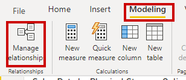

Click on New


In the first dropdown select Products and highlight the first column


In the second dropdown choose OrderDetails and highlight the ProductId column. Then click OK


Then click Close

Repeat the steps for the Store table and OrderDetails table

1. Click on the Name column under the Stores table to add a table

      

2. While having that same table select click the Count column under the OrderDetails table

      

3. While still having the table selected choose the Stacked Column chart

      

4. While still having the table selected right-click on the Name column under stores and select New group.

      

5. Select the following(Store1, Store2). Click on the Group button and rename to Physical. Select the remaining stores and click the Group button. Then rename it to Online

    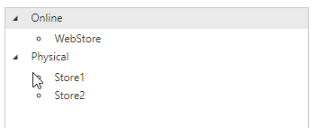

10. Finally choose the new grouped column for the Axis

      

11. Right-click the Axis column and choose Rename for this visual. Rename to **Physical Store vs Online Stores**

      

12. Right-click the Count column and choose Rename. Rename to **Sales Data**

      

13. End result

      


### Weblog data

1. Select get data from Text/CSV in PowerBI

      

2. Select weblog.csv

      

3. Click on transform data

      

4. Right-click on the URL column and choose Split Column -> By Delimiter

      

5. Leave the defaults and click OK

      

6. Right-click on the URL.2 column and choose rename to enter **NavigationHabits**

      

7. Click on the row sorting arrow and un-select any non aspx urls (eg. js, css, ico, png) then click OK

      

8. Click Close & Apply

      

9. Expand the weblog data section and click the **NavigationHabits** column

      

10. This will add a table to the display

      

11. Click on the Treemap Visualization to convert the table to a treemap

      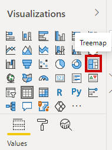

12. Drag the NavigationHabits column to the Values field of the treemap

      

13. Rename Group to Online Customers and Values to Navigation Habits

      

14. Final result

      

### Purchase and view habits

Based off the amount of time that people view an item we will reference that price and display the total amount spent as the size of the ball in the Scater plot.

1. Select get data from Text/CSV in PowerBI

      

2. Choose online shoppers and click Open.Then click the Load button

      

3. In PowerBI select the Modeling tab then click on Manage Relationships

      

4. Click on the New button

      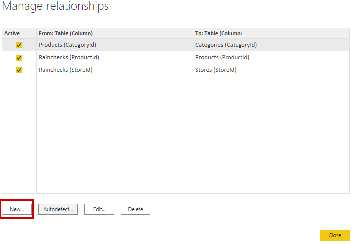

5. In the first dropdown select the Products Table and highlight the ProductId column

      

6. In the second dropdown select online_shoppers_intention and then highlight the ProductRelated column. 

      

7. Change the Cardinality dropdown to Many to many. Leave the remaining as defaults and click the OK button  

      

8. Then click the Close button

      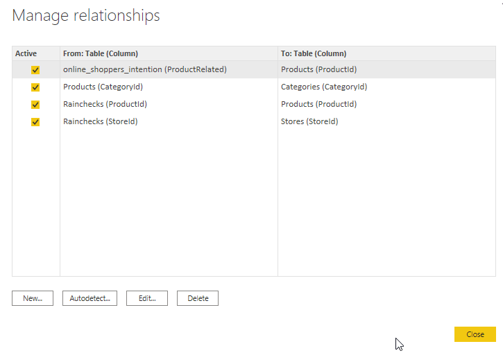

9. Add a Scatter plot Visualization 

      

10. Set the Details field to the Title column under Products

      


11. Set the X axis to ProductRelated_Duration from the online_shoppers_intention table

      

12. Set the Y axis to Price from the Products table

      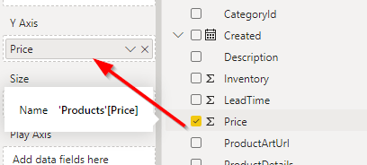

13. Finally choose the SalePrice from the OrderDetails table to Size

      

14. Rename the X axis to **Time product viewed**

      

15. Rename the Y axis to **Time viewed by price and total sale price** and then remove the Title in the formatting section.

16. Final result

      

### Digital Marketing effectiveness

In this scenario we want to see the how digital marketing campaigns effected online sales. So we will take a look at conversion data across different age groups and how much they spent based on how many impressions they received.

1. Select get data from Text/CSV in PowerBI

      

2. Choose conversion_data and click Open.Then click the Transform Data button

      

3. Click on the sort arrow for the Purchaseid column and uncheck (0, and all numbers higher than 18).

      

4. Click Close & Apply

      

5. In PowerBI select the Modeling tab then click on Manage Relationships

      

6. Click on the New button

      

7. In the first dropdown select the Products Table and highlight the ProductId column

      

8. In the second dropdown choose conversion_data and choose Purchaseid as the column. Accept the defaults and click the OK button

      

9. Then click the Close button

      

10. Add a Line and stacked column chart

      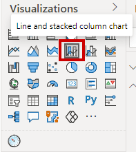

11. Right click on Price under Products and select New Group

      

12. Change the Group type to List

      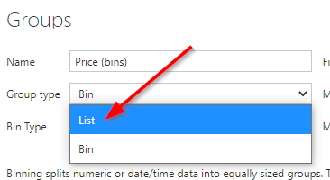

13. Select all values less than $100 and click the Group button

      

14. Rename that group to Less than $100

      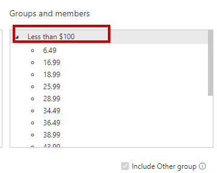

15. Select the remaining values and click Group

      

16. Rename that to Above $100 then click OK

      

17. Set the Shared axis to age. The Column series to the new Price(group) just created and the Column values to Spent. The Line values will get the Impressions column

      

Final result

    

### Location and demographic

1. Select get data from Text/CSV in PowerBI

      

2. Choose olist_customers_dataset and click Open.Then click Load

      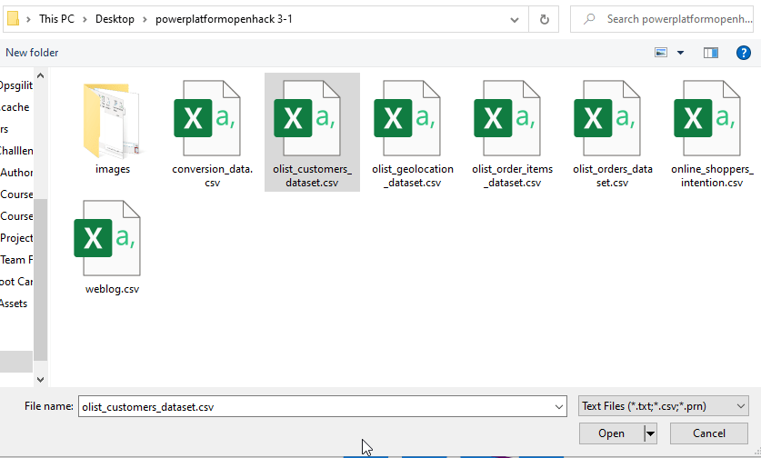

3. Choose olist_geolocation_dataset and click Open.Then click Load

      

4. Choose olist_order_items_dataset and click Open.Then click Load

      

5. Choose olist_orders_dataset and click Open.Then click Load

      

6. In PowerBI select the Modeling tab then click on Manage Relationships

      

7. Click on the New button

      

8. In the first dropdown select olist_order_items_dataset and choose order_item_id column

      

9. In the second dropdown select Products and choose the ProductId column

      

10. Leave the defaults and click OK. Then click Close

      

11. Make sure no visualization is selectd then click the Filled Map visualization

      

12. Select the Data tab on the far left edge

      

13. From the available tables select the olist_geolocation_dataset

      

14. Highlight the lat column and change the Data Category to Latitude

      

15. Highlight the long column and change the Data Category to Longitude

      

16. Click back on the Report tab on the left navigation

      
      
16. Drag lat and long to the corresponding fields in the Visual

    
    
17. Also add State from the same table. Then add in price from the olist_order_items_dataset

    

18. End Result

    
    

19. Add a slicer by clicking on the Slicer visualization

      

20. Use the State field as the Slicer field

      

21. Final report layout

    
      
### Product feedback from social media (Not real-time currently - but using Text classification)

Select get data from Text/CSV in PowerBI


Choose sampleproductdata and click Open.Then click Load


Click on Transform data


Highlight the reviews.text and reviews.title


Right click on one of the highlighted columns and choose Merge columns


Choose the separator as Tab and the leave the new column name as Merge. Then click OK


Visit https://portal.azure.com 

```
https://portal.azure.com
```

Click on New resource and search for Text Analytics


Click on Create


Choose the msibc_omnichannel Resource group previously used. The choose the same Region you have been using to store the data. Then choose a unique name. Finally set the price tier at S1. Then click Review + create


Then click the Create button


Then open the Resource and select the Keys and Endpoint tab


Click on New Source and choose Blank Query


Double click on Query1 to rename it to KeyPhrases


Click on Advanced Editor


Highlight and replace with the following text
```text
// Returns key phrases from the text in a comma-separated list
(text) => let
    apikey      = "YOUR_API_KEY_HERE",
    endpoint    = "https://<your-custom-subdomain>.cognitiveservices.azure.com/text/analytics" & "/v3.0/keyPhrases",
    jsontext    = Text.FromBinary(Json.FromValue(Text.Start(Text.Trim(text), 5000))),
    jsonbody    = "{ documents: [ { language: ""en"", id: ""0"", text: " & jsontext & " } ] }",
    bytesbody   = Text.ToBinary(jsonbody),
    headers     = [#"Ocp-Apim-Subscription-Key" = apikey],
    bytesresp   = Web.Contents(endpoint, [Headers=headers, Content=bytesbody]),
    jsonresp    = Json.Document(bytesresp),
    keyphrases  = Text.Lower(Text.Combine(jsonresp[documents]{0}[keyPhrases], ", "))
in  keyphrases
```
Return to the Azure portal and copy one of the keys and the subdomain created


Paste them in the following sections in the next text


Select the sampleproductdata again then click Add column and select the Invoke Custom Function


In the Invoke Custom Function panel set the New Column name to keyphrases. Then choose the Function query keyPhrases previously created. Then in the dropdown choose Merged. Finally click OK


Click the continue button on the yellow bar. If it requests credentials choose Anonymous because we are using the access key.


Click the checkbox to ignore Privacy Levels and click Save


Finally click on the Home tab and click Close & Apply


Ignore any errors


Click on the ellipses under Visualizations and choose Get more visuals


Search for the word cloud and click Add for the Word Cloud Visual


Click the Word Cloud Visualization to add it to the screen


Drag keyphrases to the Category field


Click on the Format icon for the Word Cloud


Expand the Stop Words section and paste in the following. Disable the Title and also disable the Rotate Text option.

```text
of hello loggin cash id new thats
```

Final result


### Add Sentiment Analysis to the reviews

Right click on sampleproductdata and choose Edit query


Create another Blank Query 


Rename it sentiment


Click on Advanced Editor


Highlight and replace with the following text
```text
// Returns the sentiment score of the text, from 0.0 (least favorable) to 1.0 (most favorable)
(text) => let
    apikey      = "YOUR_API_KEY_HERE",
    endpoint    = "https://<your-custom-subdomain>.cognitiveservices.azure.com" & "/text/analytics/v3.0/sentiment",
    jsontext    = Text.FromBinary(Json.FromValue(Text.Start(Text.Trim(text), 5000))),
    jsonbody    = "{ documents: [ { language: ""en"", id: ""0"", text: " & jsontext & " } ] }",
    bytesbody   = Text.ToBinary(jsonbody),
    headers     = [#"Ocp-Apim-Subscription-Key" = apikey],
    bytesresp   = Web.Contents(endpoint, [Headers=headers, Content=bytesbody]),
    jsonresp    = Json.Document(bytesresp),
    sentiment   = jsonresp[documents]{0}[confidenceScores]
in  sentiment
```

Visit https://portal.azure.com 

```
https://portal.azure.com
```

Click on New resource and search for Sentiment Analysis


Click on Create


Return to the Azure portal and copy one of the keys and the subdomain created


Paste them in the following sections in the next text


Select the sampleproductdata again then click Add column and select the Invoke Custom Function


In the Invoke Custom Function panel set the New Column name to Sentiment. Then choose the Function query sentiment previously created. Then in the dropdown choose Merged. Finally click OK


In the newly created Sentiment column we need to split the cells. Click on the opposing arrows


Uncheck neutral and click OK


Finally click on the Home tab and click Close & Apply


It might take a while to process the sentiment values.

Ignore any errors


Add a slicer to the canvas


Drag the Title from the Products table to Field column


Add a KPI Visualization


Set the Indicator to Title from the Products Table. Set the Trend Axis to Sentiment.negative and set the Target goals to Sentiment.positive


### Add Gender to Persona

Add a Stacked column chart to the report


Set the Axis to gender from the conversion_data. Values to Gender


Final gender study


### Publish

1. Navigate to https://app.powerbi.com/
      ```
      https://app.powerbi.com/
      ```

2. Click sign in

      

3. In the navigation click on Workspaces and click Create a workspace

      

4. Return to the Power BI Desktop application

5. Click on the Publish button in the Navigation

      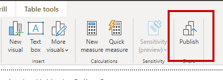

6. Choose your workspace that was just created and click Select

      

7. Power BI will publish to the workspace

      

8. Power BI has completed publishing

      

9. Navigate to https://app.powerbi.com/
      ```
      https://app.powerbi.com/
      ```

10. Expand the My workspace section to open your workspace

      

11. Click on the report name you created to see the results

      

## Additional Resources  

[Microsoft Industry Blog - Retail](https://cloudblogs.microsoft.com/industry-blog/retail/)  

[Get to know your customer](https://www.microsoft.com/en-us/industry/retail/know-your-customer?activetab=pivot%3aprimaryr11)  

[Retail/Consumer Goods Industry](https://www.microsoft.com/en-us/industry/retail-consumer-goods)  

[Guide for SQL Database to Data Factory](https://docs.microsoft.com/en-us/azure/data-factory/connector-azure-sql-database)

[Guide to using the copy data tool in Azure Data Factory](https://docs.microsoft.com/en-us/azure/data-factory/tutorial-hybrid-copy-data-tool)

[Guide for SQL Database to Synapse Analytics in Data Factory](https://docs.microsoft.com/en-us/azure/data-factory/load-azure-sql-data-warehouse)

[Guide for Synapse Analytics to Power BI](https://docs.microsoft.com/en-us/azure/synapse-analytics/quickstart-power-bi)